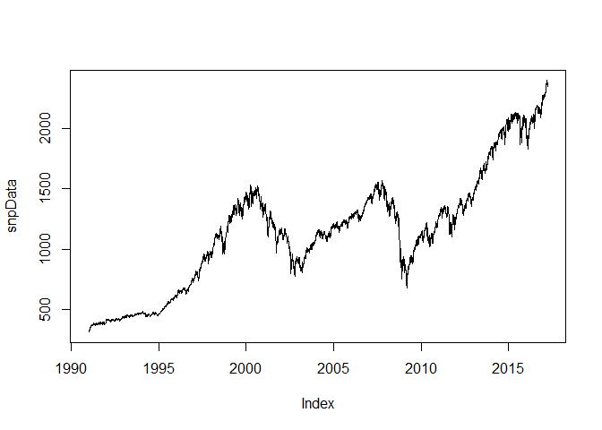
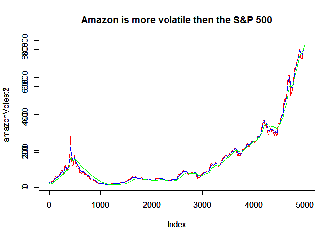
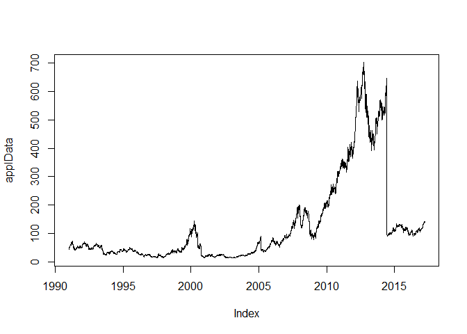
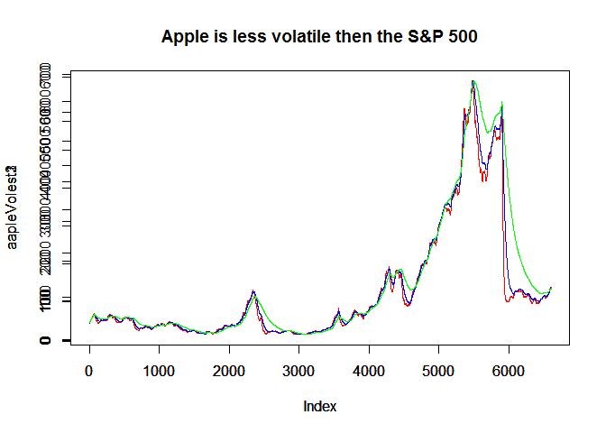

# Volatility
Nathan J. Tuttle  
March 22, 2017  


## Lecture Assignment
Half of you will be assigned to find a series that is less volatile than the S&P 500, the other half a series that is more volatile.

### Download the data.

```r
library(tseries)
```

```
## Warning: package 'tseries' was built under R version 3.2.5
```

```r
volatility<-get.hist.quote('^vix',quote='Close')
```

```
## Warning in download.file(url, destfile, method = method, quiet = quiet):
## downloaded length 337488 != reported length 200
```

```r
snpData<- get.hist.quote('^gspc',quote='Close')
```

```
## Warning in download.file(url, destfile, method = method, quiet = quiet):
## downloaded length 517673 != reported length 200
```

```r
amznData <-get.hist.quote('amzn',quote='Close')
```

```
## Warning in download.file(url, destfile, method = method, quiet = quiet):
## downloaded length 323143 != reported length 200
```

```
## time series starts 1997-05-15
```

```r
applData <-get.hist.quote('aapl',quote='Close')
```

```
## Warning in download.file(url, destfile, method = method, quiet = quiet):
## downloaded length 439801 != reported length 200
```
### *Calculate log returns.*

```r
snpPret<-log(lag(snpData)) - log(snpData)


latestVolatilitysnp<-tail(snpPret,1)$Close[[1]]


amznVol<-log(lag(amznData)) - log(amznData)
latestVolatilityAmzn<-tail(amznVol,1)$Close[[1]]


aaplVol<-log(lag(applData)) - log(applData)
latestVolatilityAAPL<-tail(aaplVol,1)$Close[[1]]

# snp is more volatile then Amazon
latestVolatilitysnp<latestVolatilityAmzn
```

```
## [1] FALSE
```

```r
# SNP is less volatile then Apple
latestVolatilitysnp<latestVolatilityAAPL
```

```
## [1] TRUE
```

### Calculate volatility measure.

```r
#Volatility
SNVol <- sd(snpPret) * sqrt(250) *100

Vol<- function(d,logrets)
{
  var=0
  lam=0
  varlist<-NULL
  for(r in logrets)
  {
    lam=lam*(1- 1/d) +1
    var = (1 - 1/lam)*var + (1/lam)*r^2
      varlist<- c(varlist,var)
  }
  sqrt(varlist)
}
```
### Calculate volatility over entire length of series for various three different decay factors.

```r
amazonVolest1<-Vol(10,amznData)
amazonVolest2<-Vol(30,amznData)
amazonVolest3<-Vol(100,amznData)

aapleVolest1<-Vol(10,applData)
aapleVolest2<-Vol(30,applData)
aapleVolest3<-Vol(100,applData)
```

### Plot the results, overlaying the volatility curves on the data, just as was done in the S&P example.

```r
plot(snpData)
```

<!-- -->

```r
plot(amazonVolest1, type='l',col='red')
par(new=TRUE)
plot(amazonVolest2, type='l',col='blue')
par(new=TRUE)
plot(amazonVolest3, type='l',col='green')
title("Amazon is more volatile then the S&P 500")
```

<!-- -->

```r
plot(applData)
```

<!-- -->

```r
plot(aapleVolest1, type='l',col='red')
par(new=TRUE)
plot(aapleVolest2, type='l',col='blue')
par(new=TRUE)
plot(aapleVolest3, type='l',col='green')
title("Apple is less volatile then the S&P 500")
```

<!-- -->

```r
#applData
```

# Deliverable
  - Upload the Markdown file containing your code, analysis, and discussion to GitHub. 
  - Post a link to the Markdown file in the space below.
  - The markdown document should have code for:
      - entering the data, 
      - calculating log returns, 
      - calculating volatility measure, and 
      - calculating volatility for the entire series using three different decay factors.
      - Also needs to have code for a plot (and the plot itself) with the data and volatility overlaid.
      
# *The discussion board will talk about the differences in the volatility plots for different stocks.*


